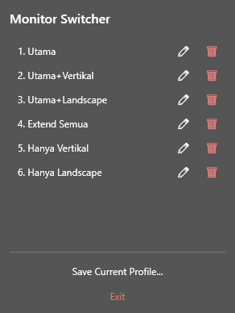

# MonitorSwitcher

MonitorSwitcher adalah aplikasi Windows untuk menyimpan dan mengganti profil konfigurasi monitor dengan cepat. Aplikasi ini berjalan dari system tray, lalu membaca profil monitor dari file `.config` yang berada di folder aplikasi.

Cocok untuk setup multi-monitor yang sering berubah, misalnya:

- monitor utama saja
- monitor utama + monitor vertikal
- monitor utama + monitor landscape
- semua monitor aktif
- hanya monitor tertentu

## Screenshot



## Cara Pakai

1. Jalankan aplikasi `MonitorSwitcher`.
2. Atur mode monitor di Windows sesuai kondisi yang ingin disimpan.
   - Contoh: aktifkan monitor utama saja, extend semua monitor, atau aktifkan monitor vertikal.
3. Klik ikon MonitorSwitcher di system tray.
4. Klik **Save Current Profile**.
5. Masukkan nama profil.
6. Untuk mengganti mode monitor, klik ikon tray lagi lalu pilih profil yang ingin dipakai.

Profil yang sudah tersimpan dapat di-rename atau dihapus dari menu tray.

## Cara Menjalankan dari Source

Pastikan sudah menginstall:

- Windows
- .NET SDK 8.0 atau lebih baru

Jalankan dari folder proyek:

```powershell
dotnet run
```

Build release:

```powershell
dotnet build -c Release
```

Publish executable Windows x64:

```powershell
dotnet publish -c Release -r win-x64 --self-contained true
```

Hasil publish akan berada di folder:

```text
bin\Release\net8.0-windows\win-x64\publish
```

## Mode CLI

Selain lewat tray, aplikasi juga bisa dipakai lewat command line:

```powershell
MonitorSwitcher.exe save "NamaProfil"
MonitorSwitcher.exe load "NamaProfil"
```

Perintah tersebut akan memakai file:

```text
NamaProfil.config
```

## Teknis

- Bahasa: C#
- Framework: .NET 8
- Target: `net8.0-windows`
- UI: Windows Forms system tray + WPF popup
- API monitor: Windows Display Configuration API melalui `User32.dll`
- File profil: binary `.config` berisi data konfigurasi display dari Windows

File penting:

- `Program.cs` - entry point aplikasi dan mode CLI
- `TrayApplicationContext.cs` - ikon dan behavior system tray
- `TrayUI.xaml` / `TrayUI.xaml.cs` - tampilan popup tray
- `DisplayManager.cs` - logic save/load konfigurasi monitor
- `*.config` - profil monitor yang tersimpan

## Catatan

Profil monitor bergantung pada monitor yang terhubung. Jika monitor yang sedang tersambung berbeda dari saat profil dibuat, proses load profil bisa gagal atau hasilnya tidak sesuai.
